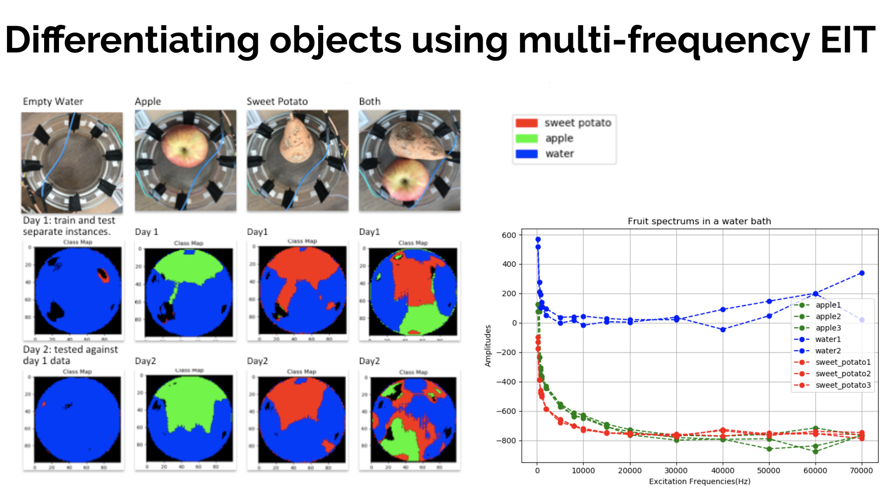
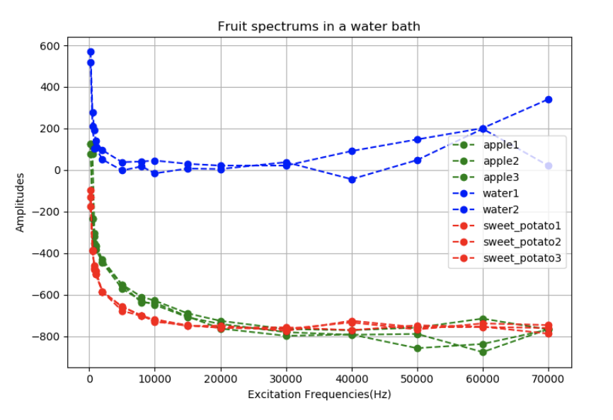
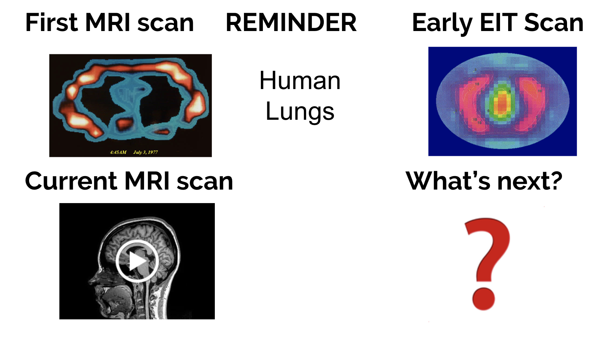

# BHV Workshop - Open Electrical Impedance Tomography (EIT)
 
_Biohacking Village DIY Workshops_
 
As part of our commitment to biohacking and open science, this 2019 DEF CON [Biohacking Village](https://www.villageb.io/) workshop has been converted to a DIY/at home format. We hope you find this project instructive.
 
## About This Workshop
**Workshop leads:** Jean Rintoul 
 
Biomedical imaging has previously been expensive and near impossible to hack and experiment with. If more people experimented and understood how imaging works we could move it forward much faster and make these transformative technologies available to everyone. 

Using EIT hardware, such as Spectra, you can use safe levels of AC current to recreate an image of any conductive material -- such as your lungs, arm or head. This is the same tomographic reconstruction technique as a cat scan. 

**Workshop Goal**

To provide participants with the basic understanding of open source biomedical imaging and the tools needed to do electrical impedance tomography themselves. 
 

## Materials (What you will need)

+ Computer 
+ [Spectra](https://www.crowdsupply.com/mindseye-biomedical/spectra) or Biohacking Village/ OpenHAK badge

## About Open Electrical Impedance Tomography (EIT)

Electrical Impedance Tomography (EIT) needs hardware to take readings, algorithms to process the data and software to display the information. The Open EIT team worked brought that together with Spectra, an open source and safe way to experiment with biomedical imaging. It has reconstruction algorithms, a PCB and can re-create an image in real time. 

Data collection is done with an AC current, it is sent through the conductive medium where the impedance magnitude and phase is measured at the other electrode. This process is repeated around every combination of an array of electrodes, which gives us the base data to perform a tomographic reconstruction. 

 

The [Open EIT project](https://openeit.github.io) has an easy to use dashboard with reconstruction algorithms that can be run in real-time or alternatively read in offline files. There are 3 different reconstruction algorithms currently available. The true strength of this technique is that you can get a dielectric spectrum at every pixel, meaning you can see differences in material properties really well. 

**Deeper Dive** 
Watch Jean Rintoul's Hackaday Supercon talk on Low Cost Open Source Biomedical Imaging:
https://www.youtube.com/watch?v=5kuseBfnvzs

## Instructions

Full instructions can be found at: https://openeit.github.io/docs/html/index.html

The Open EIT site provides information on installation and then how to produce three types of results.

1. Time Series

 

2. Bioimpedance Spectroscopy

 

3. EIT Algorithms

 

### Future of Open EIT

MRI started with some pretty rough image, as shown below with the original thorax picture. MRI's still cost millions of dollars, and are never going to be so small and accessible that anyone can have one. Now EIT is in its early stages, and it will be interesting to see how it improves. **If you’d like to collaborate on this project, have a look the code on GitHub https://github.com/openeit for issues that need to be solved or improvements that could be made.**

Below on the left is the first ever MRI scan of the human thorax, with a current 3 Tesla scan below it to show how far the technology has progressed. On the right is one of first EIT scans with space reserved for how far the technology will go in the future. 

 

## Resources

Spectra: Open Biomedical Imaging - Hackaday

https://hackaday.io/project/159737-spectra-open-biomedical-imaging

OpenHAK

https://www.openhak.com/

This open source project intends to allow users to discover activity tracking and how it works. 

